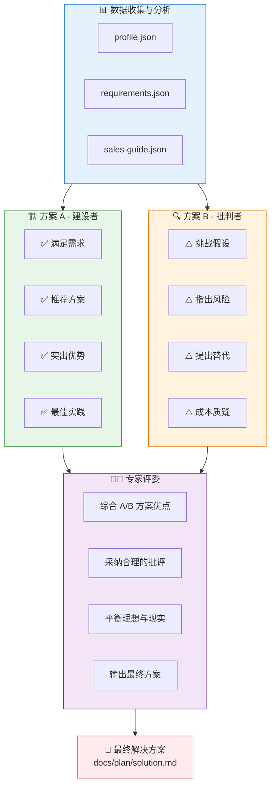
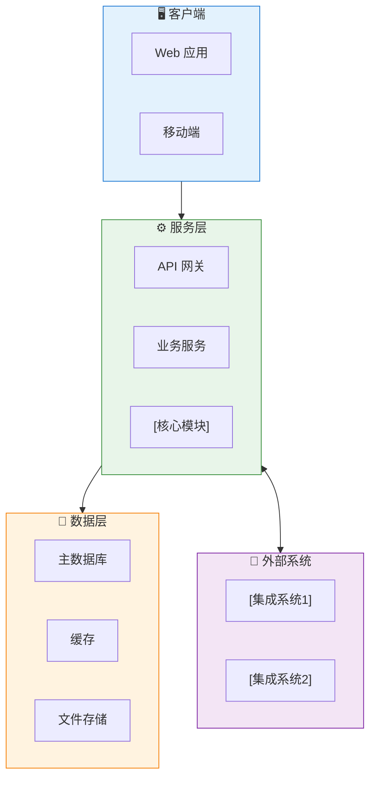
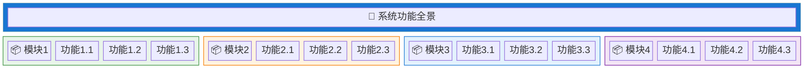
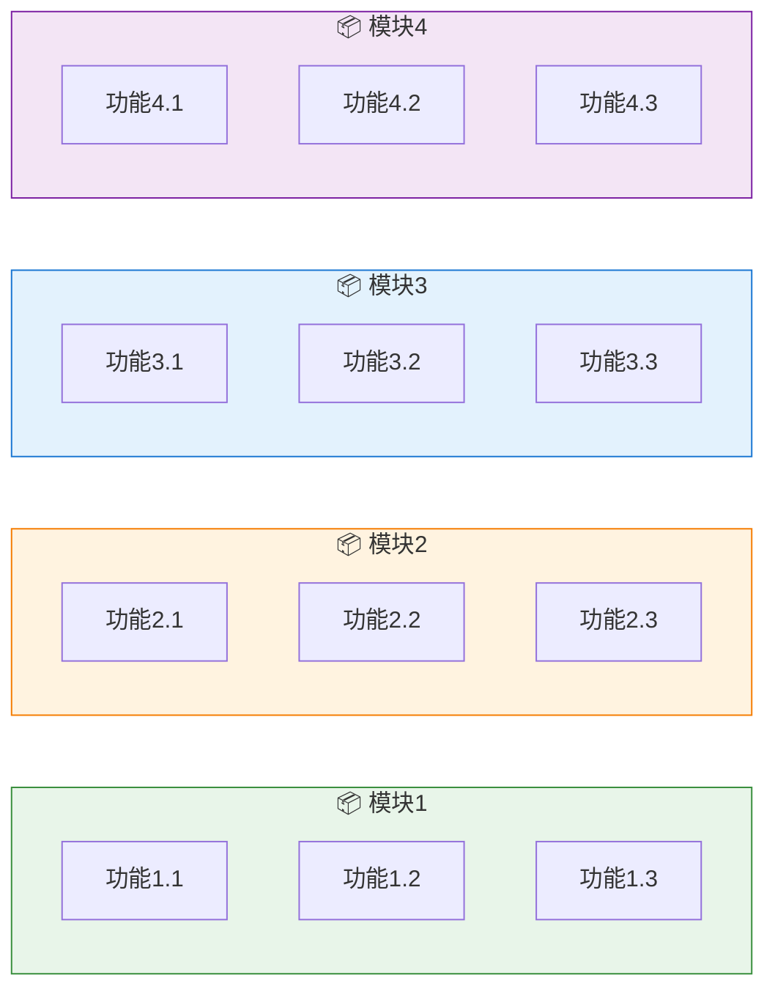
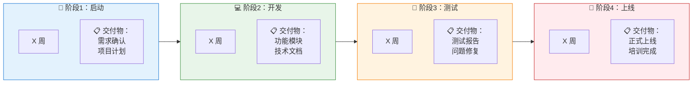
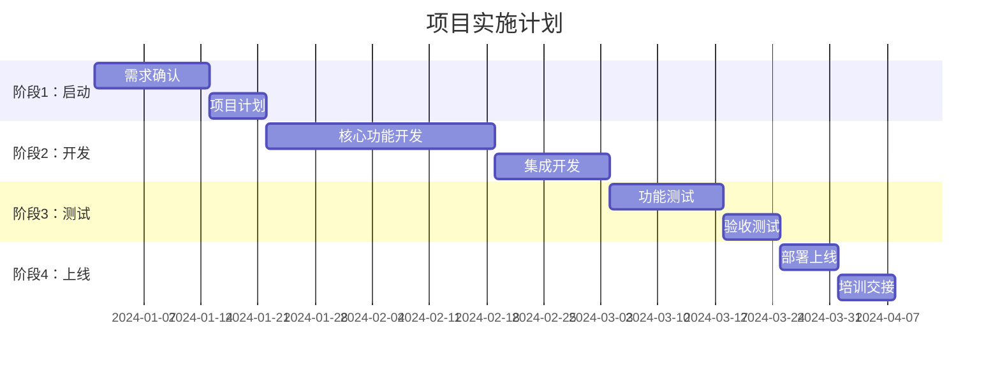

# SyncMind 解决方案生成 Skill

基于客户需求、客户档案等信息，采用 **A/B 方案对弈 + 专家评审** 机制，生成高质量的解决方案文档。

---

## 📊 架构图渲染说明

本文档使用 **Mermaid** 语法绘制架构图，支持多种渲染方式：

### 方式 1：平台原生支持（推荐）

以下平台直接支持 Mermaid 渲染，无需额外处理：
- ✅ GitHub / GitLab
- ✅ Notion
- ✅ 语雀
- ✅ Obsidian
- ✅ Typora

### 方式 2：生成图片 URL

使用 [mermaid.ink](https://mermaid.ink) 服务将 Mermaid 代码转为图片：

```markdown
<!-- 语法 -->


<!-- 示例：将下方代码 Base64 编码后拼接 -->

```

**快速转换方法**：
1. 访问 https://mermaid.live
2. 粘贴 Mermaid 代码
3. 点击 "Copy Image URL" 获取图片链接

### 方式 3：本地 CLI 生成

```bash
# 安装 mermaid-cli
npm install -g @mermaid-js/mermaid-cli

# 生成 PNG
mmdc -i diagram.mmd -o diagram.png

# 生成 SVG（推荐，矢量图更清晰）
mmdc -i diagram.mmd -o diagram.svg
```

---

## 核心机制：A/B 方案对弈 + 专家评审



> 💡 **图片渲染**：上述 Mermaid 代码在支持 Mermaid 的平台（GitHub、Notion、语雀等）会自动渲染。如需生成图片 URL，可使用 [mermaid.ink](https://mermaid.ink) 服务。

## 定位

| Skill | 阶段 | 核心问题 | 主要用户 |
|-------|------|----------|----------|
| `/profile` | 拜访前 | 客户是谁？ | 销售 |
| `/sales-guide` | 拜访前 | 怎么打？ | 销售 |
| `/requirements` | 拜访后 | 客户要什么？ | 售前 |
| **`/plan-writer`** | **方案阶段** | **怎么解决？** | **方案团队** |

## 数据来源

### 必须读取

| 文件 | 用途 |
|------|------|
| `docs/customer/requirements.json` | **核心输入**：客户需求、约束条件、成功标准 |
| `docs/customer/profile.json` | 客户背景、行业、规模、痛点 |

### 建议读取

| 文件 | 用途 |
|------|------|
| `docs/customer/sales-guide.json` | 竞对分析、价值主张、决策链 |
| `docs/customer/followups.json` | 沟通历史、客户反馈 |
| `docs/knowledge-base/index.json` | 行业元模型索引，匹配行业知识 |

### 补充检查

如果 `requirements.json` 信息不完整，主动从其他文件补充：

| 缺失信息 | 补充来源 |
|----------|----------|
| 预算范围 | `sales-guide.json` 中的 `valueProposition.roi` |
| 痛点描述 | `profile.json` 中的 `painPoints` |
| 决策人 | `sales-guide.json` 中的 `decisionChain` |
| 时间要求 | `requirements.json` 中的 `constraints.timeline` |

---

## 工作流程

### Phase 1: 数据收集与分析

#### Step 1.1: 读取所有数据源

```
读取顺序：
1. docs/customer/requirements.json  (核心)
2. docs/customer/profile.json       (背景)
3. docs/customer/sales-guide.json   (补充)
4. docs/customer/followups.json     (参考)
```

#### Step 1.2: 知识库匹配

从 requirements 中提取客户行业、业务场景关键词，匹配知识库元模型：

```
1. 读取 docs/knowledge-base/index.json
2. 从 requirements 提取：
   - 客户行业（profile.industry）
   - 业务场景关键词（functionalNeeds[].module, businessNeeds[].category）
   - 软件类型线索（background.currentSystems）
3. 遍历 index.catalog，匹配：
   - industry 精确匹配
   - tags / keywords 关键词匹配
   - applicableScenarios 场景匹配
   - 排除 antiSignals 命中的结果
4. 读取命中的元模型完整内容
5. 按成熟度标注引用可信度：
   - L1-L2：仅作参考方向
   - L3+：可深度引用模块设计和流程
   - L4+：可引用竞品分析和差异化策略
```

**匹配结果用于**：
- 方案设计章节：参考元模型的核心模块和业务流程
- 功能规划：参考元模型的标准功能清单，确保不遗漏行业关键功能
- 竞争策略：参考元模型的竞品和差异化信息
- 客户沟通：用行业术语提升方案专业感

**引用标注**：方案中引用元模型时标注来源

```markdown
> 参考元模型：MES（制造执行系统）| 成熟度 L3 | 最近审核 2026-01-27
```

#### Step 1.3: 信息完整性检查

检查以下关键信息是否完整：

| 检查项 | 完整 | 部分 | 缺失 |
|--------|------|------|------|
| 核心需求 | ✓ | △ | ✗ |
| 预算范围 | ✓ | △ | ✗ |
| 时间要求 | ✓ | △ | ✗ |
| 技术约束 | ✓ | △ | ✗ |
| 成功标准 | ✓ | △ | ✗ |

**如果关键信息缺失**：
- 从其他数据源补充
- 标注"基于假设"
- 在方案中说明需要确认

#### Step 1.4: 需求摘要整理

提炼关键信息：

```markdown
【客户画像】
- 客户名称：XXX
- 行业/规模：XXX
- 核心痛点：XXX

【项目概况】
- 项目名称：XXX
- 项目类型：XXX（新建/改造/升级）
- 核心目标：XXX

【关键约束】
- 预算：XXX
- 时间：XXX
- 技术：XXX
- 资源：XXX

【成功标准】
- 业务：XXX
- 技术：XXX
- 用户：XXX
```

---

### Phase 2: 方案 A - 建设者视角

以**积极、建设性**的角度生成方案。

#### 方案 A 的特点

| 维度 | 方案 A 倾向 |
|------|-------------|
| **态度** | 积极、乐观、推荐 |
| **重点** | 满足需求、突出价值、最佳实践 |
| **风险观** | 可控、可缓解 |
| **报价观** | 物有所值、长期收益 |

#### 方案 A 需要回答的问题

1. **为什么选择这个方案？**
   - 方案的核心思路是什么？
   - 为什么这个方案最适合客户？

2. **怎么实现客户目标？**
   - 功能设计如何满足需求？
   - 技术架构如何支撑业务？

3. **为什么值这个价格？**
   - 投入产出比如何？
   - 长期价值是什么？

4. **风险怎么控制？**
   - 主要风险是什么？
   - 缓解措施是什么？

---

### Phase 3: 方案 B - 批判者视角

以**批判、挑刺**的角度审视方案 A。

#### 方案 B 的特点

| 维度 | 方案 B 倾向 |
|------|-------------|
| **态度** | 审慎、质疑、挑战 |
| **重点** | 挑战假设、指出风险、提出替代 |
| **风险观** | 需要重视、可能低估 |
| **报价观** | 可能过高、需要优化 |

#### 方案 B 需要挑战的点

1. **需求理解是否准确？**
   - 是否过度解读了客户需求？
   - 是否遗漏了隐性需求？
   - 客户真正想要的是不是这个？

2. **方案是否过度设计？**
   - 是否有不必要的功能？
   - 是否有更简单的实现方式？
   - 是否"杀鸡用牛刀"？

3. **成本估算是否合理？**
   - 工作量是否低估？
   - 是否有隐藏成本？
   - 客户预算够不够？

4. **时间计划是否可行？**
   - 计划是否过于乐观？
   - 是否考虑了依赖和风险？
   - 有没有Buffer？

5. **风险是否被低估？**
   - 技术风险是否充分考虑？
   - 客户配合度风险？
   - 外部依赖风险？

6. **有没有替代方案？**
   - 有没有更简单的方案？
   - 有没有更便宜的方案？
   - 分阶段实施是否更好？

#### 方案 B 的输出

```markdown
【方案 A 的潜在问题】

1. **需求理解方面**
   - 问题：XXX
   - 影响：XXX
   - 建议：XXX

2. **方案设计方面**
   - 问题：XXX
   - 影响：XXX
   - 建议：XXX

3. **成本估算方面**
   - 问题：XXX
   - 影响：XXX
   - 建议：XXX

4. **风险评估方面**
   - 问题：XXX
   - 影响：XXX
   - 建议：XXX

【替代方案建议】
- 替代方案 1：XXX
- 替代方案 2：XXX
```

---

### Phase 4: 专家评委 - 综合评审

以**资深专家**的视角，综合 A/B 方案，输出最终方案。

#### 专家评委的原则

| 原则 | 说明 |
|------|------|
| **客户利益优先** | 方案要真正解决客户问题，而不是卖产品 |
| **务实可行** | 在理想与现实之间找平衡 |
| **风险可控** | 不回避风险，但要有应对措施 |
| **价值清晰** | 让客户清楚知道花钱买到了什么 |

#### 专家评委的工作

1. **采纳 A 方案的优点**
   - 核心方案思路
   - 功能设计亮点
   - 价值主张

2. **采纳 B 方案的合理批评**
   - 调整过度设计的部分
   - 补充被低估的风险
   - 考虑更优的替代方案

3. **补充专家视角**
   - 行业最佳实践
   - 类似项目经验
   - 潜在的坑和建议

4. **输出综合评审意见**

```markdown
【评审意见】

✅ 采纳 A 方案：
- [采纳点1及原因]
- [采纳点2及原因]

⚠️ 采纳 B 方案批评：
- [采纳点1及调整]
- [采纳点2及调整]

💡 专家补充：
- [补充建议1]
- [补充建议2]

📋 最终方案要点：
- [要点1]
- [要点2]
```

---

### Phase 5: 生成最终方案文档

基于专家评审结果，生成正式的解决方案文档。

---

## 解决方案文档模板

输出文件：`docs/plan/{project-name}-solution.md`

```markdown
---
name: [项目名称]
description: [项目描述]
metadata:
  type: 解决方案
  customer: [客户名称]
  version: 1.0
  created: [创建日期]
  author: [作者]
---

<div align="center">

# 🎯 [项目名称]
## 解决方案

**客户**：[客户名称]  
**版本**：V1.0  
**日期**：[日期]

---

*本方案基于客户需求分析，经过多角度论证，为客户量身定制*

</div>

---

## 📋 目录

- [1. 执行摘要](#1-执行摘要)
- [2. 项目背景](#2-项目背景)
- [3. 需求理解](#3-需求理解)
- [4. 解决方案](#4-解决方案)
- [5. 实施计划](#5-实施计划)
- [6. 投资与回报](#6-投资与回报)
- [7. 风险与保障](#7-风险与保障)
- [8. 为什么选择我们](#8-为什么选择我们)
- [9. 下一步行动](#9-下一步行动)
- [附录](#附录)

---

## 1. 执行摘要

> 💡 **一句话概括**：[用一句话说清楚这个方案能帮客户解决什么问题，带来什么价值]

### 1.1 项目概览

| 项目 | 内容 |
|------|------|
| **客户名称** | [客户名称] |
| **项目名称** | [项目名称] |
| **项目类型** | [新建/改造/升级] |
| **核心目标** | [一句话核心目标] |
| **预计投资** | [金额范围] |
| **预计周期** | [时间范围] |
| **预期 ROI** | [投资回报] |

### 1.2 核心价值

<table>
<tr>
<td width="25%" align="center">
<h3>📈</h3>
<b>[价值点1]</b><br>
[具体数据/描述]
</td>
<td width="25%" align="center">
<h3>💰</h3>
<b>[价值点2]</b><br>
[具体数据/描述]
</td>
<td width="25%" align="center">
<h3>⚡</h3>
<b>[价值点3]</b><br>
[具体数据/描述]
</td>
<td width="25%" align="center">
<h3>🛡️</h3>
<b>[价值点4]</b><br>
[具体数据/描述]
</td>
</tr>
</table>

### 1.3 方案亮点

| # | 亮点 | 说明 |
|---|------|------|
| 1 | **[亮点1]** | [简要说明] |
| 2 | **[亮点2]** | [简要说明] |
| 3 | **[亮点3]** | [简要说明] |

---

## 2. 项目背景

### 2.1 客户概况

[简要介绍客户，1-2段]

### 2.2 现状与挑战

#### 当前现状

[描述客户当前的业务/系统现状]

#### 面临的挑战

| # | 挑战 | 影响 | 紧迫性 |
|---|------|------|--------|
| 1 | [挑战1] | [影响描述] | 🔴 高 |
| 2 | [挑战2] | [影响描述] | 🟡 中 |
| 3 | [挑战3] | [影响描述] | 🟢 低 |

### 2.3 项目背景

[描述项目发起的背景、触发因素]

---

## 3. 需求理解

### 3.1 核心需求

> 我们理解，客户最核心的需求是：**[一句话总结]**

#### 业务需求

| # | 需求 | 优先级 | 来源 |
|---|------|--------|------|
| 1 | [需求1] | P0 必须 | 客户明确提出 |
| 2 | [需求2] | P1 重要 | 客户明确提出 |
| 3 | [需求3] | P2 期望 | 我方建议 |

#### 技术需求

| # | 需求 | 说明 |
|---|------|------|
| 1 | [技术需求1] | [说明] |
| 2 | [技术需求2] | [说明] |

### 3.2 约束条件

| 约束类型 | 具体要求 | 备注 |
|----------|----------|------|
| **预算** | [预算范围] | [备注] |
| **时间** | [时间要求] | [备注] |
| **技术** | [技术约束] | [备注] |
| **资源** | [资源约束] | [备注] |

### 3.3 成功标准

| # | 标准 | 当前值 | 目标值 | 衡量方式 |
|---|------|--------|--------|----------|
| 1 | [标准1] | [当前] | [目标] | [如何衡量] |
| 2 | [标准2] | [当前] | [目标] | [如何衡量] |

---

## 4. 解决方案

### 4.1 方案概述

#### 整体思路

[2-3段描述整体方案思路]

#### 方案架构图

> 💡 使用 Mermaid 语法绘制架构图，支持自动渲染或转为图片



> 📝 **使用说明**：根据实际方案替换 `[核心模块]`、`[集成系统1]` 等占位符

### 4.2 功能设计

#### 功能全景



> 📝 **备选方案**：如果平台不支持 `block-beta`，可使用以下 `flowchart` 替代：

<details>
<summary>点击展开 flowchart 版本</summary>



</details>

#### 核心功能详解

**功能模块1：[模块名称]**

| 功能 | 说明 | 价值 |
|------|------|------|
| [功能1] | [说明] | [价值] |
| [功能2] | [说明] | [价值] |

**功能模块2：[模块名称]**

| 功能 | 说明 | 价值 |
|------|------|------|
| [功能1] | [说明] | [价值] |
| [功能2] | [说明] | [价值] |

[继续其他模块...]

### 4.3 技术方案

#### 技术架构

| 层次 | 技术选型 | 说明 |
|------|----------|------|
| 前端 | [技术] | [说明] |
| 后端 | [技术] | [说明] |
| 数据库 | [技术] | [说明] |
| 部署 | [方式] | [说明] |

#### 技术亮点

- **[亮点1]**：[说明]
- **[亮点2]**：[说明]

### 4.4 集成方案

| 集成系统 | 集成方式 | 数据流向 | 说明 |
|----------|----------|----------|------|
| [系统1] | [API/文件/...] | [输入/输出/双向] | [说明] |
| [系统2] | [API/文件/...] | [输入/输出/双向] | [说明] |

---

## 5. 实施计划

### 5.1 项目阶段



> 📝 **使用甘特图**（适合展示时间线）：

<details>
<summary>点击展开甘特图版本</summary>



</details>

### 5.2 详细计划

#### 阶段1：[阶段名称]（第X-X周）

| 任务 | 负责方 | 交付物 | 里程碑 |
|------|--------|--------|--------|
| [任务1] | [我方/客户] | [交付物] | - |
| [任务2] | [我方/客户] | [交付物] | ✓ 里程碑1 |

#### 阶段2：[阶段名称]（第X-X周）

| 任务 | 负责方 | 交付物 | 里程碑 |
|------|--------|--------|--------|
| [任务1] | [我方/客户] | [交付物] | - |
| [任务2] | [我方/客户] | [交付物] | ✓ 里程碑2 |

[继续其他阶段...]

### 5.3 里程碑

| # | 里程碑 | 时间 | 验收标准 |
|---|--------|------|----------|
| M1 | [里程碑1] | 第X周 | [验收标准] |
| M2 | [里程碑2] | 第X周 | [验收标准] |
| M3 | [里程碑3] | 第X周 | [验收标准] |

### 5.4 项目团队

#### 我方团队

| 角色 | 职责 | 投入 |
|------|------|------|
| 项目经理 | [职责] | [X人/比例] |
| 产品经理 | [职责] | [X人/比例] |
| 开发工程师 | [职责] | [X人/比例] |
| 测试工程师 | [职责] | [X人/比例] |

#### 客户方配合

| 角色 | 职责 | 投入要求 |
|------|------|----------|
| 项目经理 | [职责] | [投入要求] |
| 业务专家 | [职责] | [投入要求] |
| IT 对接人 | [职责] | [投入要求] |

---

## 6. 投资与回报

### 6.1 投资概算

#### 费用明细

| 费用项 | 金额 | 说明 |
|--------|------|------|
| 软件/开发费用 | ¥XX万 | [说明] |
| 实施服务费用 | ¥XX万 | [说明] |
| 硬件/云资源 | ¥XX万 | [说明] |
| 培训费用 | ¥XX万 | [说明] |
| 年度维护费用 | ¥XX万/年 | [说明] |
| **合计** | **¥XX万** | - |

#### 付款方式

| 节点 | 比例 | 金额 | 条件 |
|------|------|------|------|
| 合同签订 | XX% | ¥XX万 | 合同生效 |
| 里程碑1 | XX% | ¥XX万 | [验收标准] |
| 里程碑2 | XX% | ¥XX万 | [验收标准] |
| 终验 | XX% | ¥XX万 | 系统上线验收 |

### 6.2 投资回报分析

#### 可量化收益

| 收益项 | 计算方式 | 年度收益 |
|--------|----------|----------|
| [收益1] | [计算] | ¥XX万/年 |
| [收益2] | [计算] | ¥XX万/年 |
| **合计** | - | **¥XX万/年** |

#### ROI 分析

```
投资总额：¥XX万
年度收益：¥XX万
投资回收期：X个月

ROI = (年度收益 - 投资) / 投资 × 100% = XX%
```

#### 无形价值

- **[价值1]**：[描述]
- **[价值2]**：[描述]

---

## 7. 风险与保障

### 7.1 风险识别与应对

| # | 风险 | 概率 | 影响 | 应对措施 |
|---|------|------|------|----------|
| 1 | [风险1] | 🟡 中 | 🔴 高 | [应对措施] |
| 2 | [风险2] | 🟢 低 | 🟡 中 | [应对措施] |
| 3 | [风险3] | 🟡 中 | 🟡 中 | [应对措施] |

### 7.2 质量保障

| 保障措施 | 说明 |
|----------|------|
| **需求确认** | [说明] |
| **方案评审** | [说明] |
| **代码质量** | [说明] |
| **测试覆盖** | [说明] |
| **验收标准** | [说明] |

### 7.3 服务承诺

| 服务项 | 承诺 |
|--------|------|
| 响应时间 | [承诺] |
| 问题解决 | [承诺] |
| 系统可用性 | [承诺] |
| 数据安全 | [承诺] |

---

## 8. 为什么选择我们

### 8.1 我们的优势

<table>
<tr>
<td width="33%" align="center">
<h3>🏆</h3>
<b>[优势1标题]</b><br>
[优势描述]
</td>
<td width="33%" align="center">
<h3>💪</h3>
<b>[优势2标题]</b><br>
[优势描述]
</td>
<td width="33%" align="center">
<h3>🤝</h3>
<b>[优势3标题]</b><br>
[优势描述]
</td>
</tr>
</table>

### 8.2 成功案例

#### 案例1：[客户名称]

| 项目 | 内容 |
|------|------|
| **客户** | [客户名称] |
| **行业** | [行业] |
| **规模** | [规模] |
| **项目** | [项目描述] |
| **成果** | [量化成果] |

#### 案例2：[客户名称]

[同上格式...]

### 8.3 客户评价

> "[客户评价内容]"
> 
> —— [评价人]，[职位]，[公司]

---

## 9. 下一步行动

### 9.1 建议行动

| # | 行动 | 负责方 | 时间 |
|---|------|--------|------|
| 1 | 方案沟通与答疑 | 双方 | [时间] |
| 2 | 方案确认与报价 | 双方 | [时间] |
| 3 | 合同签订 | 双方 | [时间] |
| 4 | 项目启动 | 我方 | [时间] |

### 9.2 联系方式

| 角色 | 姓名 | 电话 | 邮箱 |
|------|------|------|------|
| 销售负责人 | [姓名] | [电话] | [邮箱] |
| 技术负责人 | [姓名] | [电话] | [邮箱] |

---

## 附录

### 附录A：术语表

| 术语 | 说明 |
|------|------|
| [术语1] | [说明] |
| [术语2] | [说明] |

### 附录B：详细功能清单

[如需要，可添加详细功能清单]

### 附录C：技术规格说明

[如需要，可添加技术规格说明]

---

<div align="center">

**感谢您的信任，期待与您合作！**

[公司名称] · [联系方式]

</div>
```

---

## 方案类型适配

根据项目类型调整方案重点：

### 业务方案（咨询类）

重点章节：
- 现状分析与诊断
- 业务流程优化建议
- 组织与管理建议
- 实施路线图

弱化章节：
- 技术架构
- 功能详解

### 产品方案（SaaS/标准产品）

重点章节：
- 产品功能介绍
- 产品优势与差异化
- 实施与配置
- 服务与支持

弱化章节：
- 详细技术架构
- 定制开发内容

### 技术方案（定制开发）

重点章节：
- 技术架构设计
- 功能详细设计
- 接口与集成
- 开发计划与资源

增加章节：
- 技术选型说明
- 性能与安全设计

### 集成方案

重点章节：
- 集成架构
- 接口设计
- 数据映射
- 测试方案

增加章节：
- 现有系统分析
- 接口规格说明

---

## 注意事项

### 方案生成原则

1. **客户导向**
   - 方案要围绕客户需求，不是展示我们的技术
   - 用客户的语言，不是技术术语
   - 突出价值，不是功能清单

2. **务实可行**
   - 不过度承诺
   - 风险要如实说明
   - 计划要留有余地

3. **差异化**
   - 突出我们的优势
   - 针对性解决客户痛点
   - 不要泛泛而谈

4. **可读性**
   - 结构清晰，层次分明
   - 图表结合，便于理解
   - 重点突出，便于快速浏览

### 常见问题避免

| 问题 | 避免方式 |
|------|----------|
| 方案过于技术化 | 用业务语言，技术细节放附录 |
| 功能堆砌没重点 | 突出核心功能，次要功能简述 |
| 价值不够量化 | 尽量用数字说话 |
| 风险轻描淡写 | 如实说明，展示应对能力 |
| 同质化严重 | 针对客户特点定制内容 |

---

## 与其他 Skill 的关系

| Skill | 关系 |
|-------|------|
| `/profile` | 输入：客户背景信息 |
| `/sales-guide` | 输入：竞对分析、价值主张 |
| `/requirements` | **核心输入**：客户需求、约束条件 |
| `/knowledge-base` | 输入：行业元模型，提升方案专业性 |
| `/spec-writer` | 下游：基于方案生成产品需求说明书 |
| `/humanizer-zh` | 后处理：去除输出内容的 AI 痕迹 |
